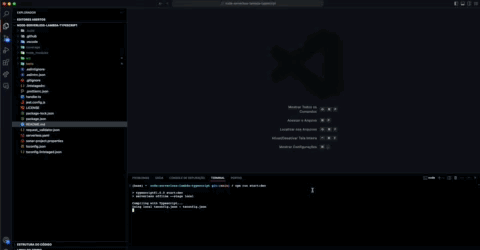

# clean-serverless-api

[](https://sonarcloud.io/summary/new_code?id=handrespatrick_node-serverless-lambda-typescript) [](https://sonarcloud.io/summary/new_code?id=handrespatrick_node-serverless-lambda-typescript) [](https://sonarcloud.io/summary/new_code?id=handrespatrick_node-serverless-lambda-typescript) [](https://sonarcloud.io/summary/new_code?id=handrespatrick_node-serverless-lambda-typescript) [](https://sonarcloud.io/summary/new_code?id=handrespatrick_node-serverless-lambda-typescript) [](https://sonarcloud.io/summary/new_code?id=handrespatrick_node-serverless-lambda-typescript) [](https://sonarcloud.io/summary/new_code?id=handrespatrick_node-serverless-lambda-typescript) [](https://sonarcloud.io/summary/new_code?id=handrespatrick_node-serverless-lambda-typescript) [](https://sonarcloud.io/summary/new_code?id=handrespatrick_node-serverless-lambda-typescript) [](https://sonarcloud.io/summary/new_code?id=handrespatrick_node-serverless-lambda-typescript) [](https://sonarcloud.io/summary/new_code?id=handrespatrick_node-serverless-lambda-typescript)

## 📚 Descrição

Aplicação serverless dedicada a listar as informações do personagem do Star Wars, passando o nome como parametro.



## 🔗 URLs

| Environment  | URL                                |
| ------------ | ---------------------------------- |
| LOCAL        | <http://localhost:3000/local/user> |
| STARWARS API | <https://swapi.dev/api>            |

## 🎯 Comandos

| Comando             | Descrição                                    |
| ------------------- | -------------------------------------------- |
| build               | Gera a versão de produção do projeto         |
| start               | Inicializa o projeto                         |
| lint                | Aplica lint em todo o projeto                |
| test                | Executa todos os testes do projeto           |
| clean               | Remove a pasta node_modules,coverage e build |
| release             | Gera uma nova versão do projeto              |
| update-dependencies | Atualiza as dependências do projeto          |

## 🍂 Pilha de tecnologia

- [NodeJS](https://nodejs.org/en)
- [TypeScript](https://www.typescriptlang.org)
- [Serverless Framework](https://www.serverless.com)
- [Jest](https://jestjs.io)
- [ESLint](https://eslint.org)
- [Prettier](https://prettier.io)
- [Lint Staged](https://github.com/okonet/lint-staged#readme)
- [Husky](https://typicode.github.io/husky/#/)
- [Commitlint](https://commitlint.js.org/#/)
- [Comitizen](https://commitizen-tools.github.io/commitizen)
- [Release It](https://github.com/release-it/release-it)
- [Github Actions](https://docs.github.com/pt/actions)
- [SonarQube](https://www.sonarqube.org)

### 📁 Estrutura

- [`application`](./src/application) - Orquestra o fluxo de dados entre o domínio e as interfaces, contendo a lógica de aplicação e casos de uso.
- [`domain`](./src/domain) - O núcleo do sistema, com regras e lógicas de negócio, entidades, e interfaces de repositórios.
- [`infra`](./src/infra) - Implementa detalhes técnicos como bancos de dados e comunicação com serviços externos.
- [`main`](./src/main) - Ponto de entrada da aplicação, responsável pela inicialização e configuração.
- [`presentation`](./src/presentation) - Interage com o usuário ou sistemas externos, tratando de requisições e respostas.

### 🏛️ Arquitetura

O projeto segue a arquitetura:

- [Clean Architecture](https://blog.cleancoder.com/uncle-bob/2012/08/13/the-clean-architecture.html)
- [Domain Driven Design](https://en.wikipedia.org/wiki/Domain-driven_design)

## 🏃 Rodando o projeto

- Instale as dependências do projeto executando o comando `npm install`

- Para Inicializar o projeto execute o comando `npm run start`

  Envie uma requisição HTTP GET conforme cURL abaixo:

  ```
  curl --location 'http://localhost:3000/local/user?name=Luke%20Skywalker' \
  --header 'Content-Type: application/json'
  ```

- Para executar os testes, execute o comando `npm run test`

- Para aplicar lint no projeto, execute o comando `npm run lint`
